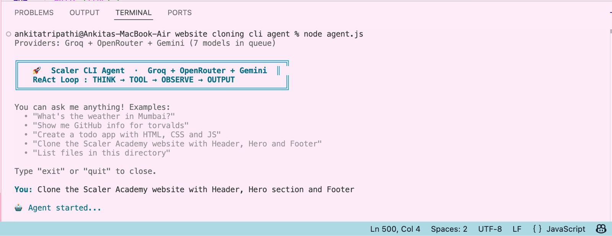

# WEBSITE CLONING CLI AGENT

This is my submission for Assignment 02 from the GenAI Engineering course.  
The project is a CLI AI agent that follows the **ReAct pattern** (Reasoning + Acting) to complete tasks step by step using tools.
---

## What it can do

The agent can:

- Get weather info
- Fetch GitHub user data
- Read, write, and edit files
- Run terminal commands
- Open files in the browser
- Generate simple web apps/pages
- Clone websites like the Scaler landing page

The main demo task is cloning the Scaler Academy homepage with a Header, Hero section, and Footer.

---

## ReAct Workflow

The agent works in a loop:
```
You type something
        ↓
   THINK — agent figures out what to do next
        ↓
   TOOL — it calls a tool (write file, run command, fetch weather, etc.)
        ↓
   OBSERVE — it sees what the tool returned
        ↓
   (repeat until done)
        ↓
   OUTPUT — final answer / result
```

Each step, the model returns a single JSON object like this:

```json
{ "step": "THINK", "content": "I need to create the folder first" }
{ "step": "TOOL", "tool_name": "executeCommand", "tool_args": { "cmd": "mkdir -p ./scaler_clone" } }
{ "step": "OBSERVE", "content": "Command executed successfully." }
{ "step": "OUTPUT", "content": "Done! The file is open in your browser." }
```


---

## Available Tools

| Tool | What it does |
|------|-------------|
| `getWeather` | Gets live weather for any city using wttr.in |
| `getGitHubUser` | Fetches public info about a GitHub user |
| `executeCommand` | Runs a shell command on your machine |
| `writeFile` | Writes content to a file (creates the folder too if needed) |
| `appendFile` | Appends content to an existing file |
| `readFile` | Reads a file |
| `listFiles` | Lists what's in a directory |
| `openInBrowser` | Opens a local file in the browser |
| `fetchWebpage` | **(NEW)** Converts any live URL into clean Markdown using the Jina Reader API so the agent can read real websites without crashing the context window |

The weather and GitHub tools are things I added myself — they were in the reference code in the assignment PDF and made sense to keep in since it shows the agent isn't just a "website builder", it can actually handle different kinds of tasks.

---

## Setting it up

You need Node.js. This agent uses a **Multi-Provider Waterfall system**. You can provide keys for Groq, OpenRouter, and Gemini all at once. The agent will automatically use the fastest free model (Groq) and fallback instantly if it hits rate limits.

```bash
git clone <your-repo-url>
cd scaler-cli-agent
npm install
```

Create a `.env` file and add any or all of these:
```
GROQ_API_KEY=gsk_...
OPENROUTER_API_KEY=sk-or-...
GEMINI_API_KEY=AIza...
```

Then just run it:
```bash
node agent.js
```

---

## Example Run


---

## Generated Scaler Clone

The generated page has:

- **Header** — logo, nav links (Courses, Mentors, Events, Blog), a Login button and a "Get Started" CTA
- **Hero section** — main headline, subtext, two CTAs, and a stats bar (number of students, hiring partners, salary hike)
- **Courses section** — 4 cards for DSA, System Design, Full Stack, and Data Science — each with a badge, duration, and enroll button
- **Footer** — links, social icons, copyright

Colors are based on the actual Scaler brand — dark background (`#0D0D1A`), their blue/indigo (`#3D3AEE`), and orange accent (`#FF6B35`). Fonts loaded via Google Fonts inside the `<style>` block so it's fully self-contained.

---

## Files in this project

```
scaler-cli-agent/
├── agent.js          ← the main file — ReAct loop + Multi-Provider + all tools
├── package.json
├── .env              ← your API key goes here (not committed)
├── .gitignore
├── README.md
└── scaler_clone/
    └── index.html    ← generated when you run the clone task
```

---

## Packages used

- `openai` — to call Groq and OpenRouter models seamlessly
- `@google/generative-ai` — to call the Gemini fallback models
- `axios` — for HTTP requests (weather, GitHub, Jina Reader API)
- `dotenv` — to load the `.env` file
- `open` — to open the generated HTML in the browser

---

## Author

- Ankita Tripathi
- 24bcs10062 

